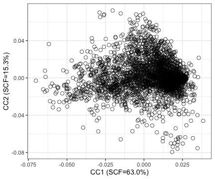

# Introduction

**CATaN** (Canonical correlation Analysis of Transcriptome and TF-gene regulatory Networks) identifies shared regulatory axes between transcription factor (TF)
binding patterns and transcriptome profiles. The resulting Canonical Component
(CC) scores are mapped to genomic SNP positions, producing annotation files
suitable for stratified LD Score Regression (S-LDSC).

## Workflow overview

1. **Filter and normalise** transcriptome count data
2. **Run CCA** between a TF-gene regulatory Networks (TF-GRN) matrix and the transcriptome
3. **Align CC scores to SNPs** using TF ChIP-seq peak coordinates
4. **make binary annotations** and export for S-LDSC

# Quick start


``` r
library(CATaN)
library(data.table)
```

## Step 1: Prepare input data

CATaN requires two matrices with shared gene identifiers as row names:

- **TF-GRN matrix**: a gene × TF matrix of TF-gene connectivity scores, derived from TF ChIP-seq data, quantifying the regulatory association between each TF and each gene.
- **transcriptome count matrix**: raw counts (gene × sample).

The TF-GRN matrix from the CATaN paper is available on Zenodo. For the transcriptome, any bulk RNA-seq raw count matrix can be used; as an example, here we use our original RNA-seq data deposited in GEO ([GSE335951](https://www.ncbi.nlm.nih.gov/geo/query/acc.cgi?acc=GSE335951)).

### TF-GRN matrix (Zenodo)

`download_tf_matrix()` downloads the matrix from Zenodo and caches it locally,
so it is only downloaded once (the file is ~2.6 GB).


``` r
matrix_file <- download_tf_matrix(tempdir())
tf_raw      <- fread(matrix_file)

## Columns 1-2 are gene index and gene ID; the rest are TF ChIP-seq samples.
tf_matrix <- as.matrix(tf_raw[, -c(1, 2)])
rownames(tf_matrix) <- tf_raw$gene_name   # Ensembl IDs (with version suffix)
dim(tf_matrix)
#> [1] 59885  2868
```

### Transcriptome counts (GEO)

The raw count matrix is retrieved from GEO as a supplementary file.


``` r
supp     <- GEOquery::getGEOSuppFiles("GSE335951", baseDir = tempdir())
geo_file <- rownames(supp)[1]

count_dt <- fread(geo_file)
counts   <- as.matrix(count_dt[, -1])
rownames(counts) <- count_dt$gene
dim(counts)
#> [1] 74628    36
```

## Step 2: Filter low-expression genes


``` r
filtered_counts <- filter_low_expression(counts)
#> Low expression filtering: 74628 -> 22608 genes (removed 52020)
#>   Criteria: count >= 10 and CPM >= 1 in >= 15% samples
```

## Step 3: Prepare matrices

Find common genes between the count data and TF-GRN matrix, and perform TMM
normalization. Version suffixes on the TF-GRN gene IDs (e.g. `.7_3`) are
stripped automatically so they match the unversioned IDs in the count matrix.


``` r
mats <- prepare_matrices(filtered_counts, tf_matrix)
#> Stripped version suffix from 59885 TF gene IDs
#> Removing 82 duplicated genes from TF matrix
#> Prepared matrices: 19573 common genes, 2868 TFs, 36 samples
names(mats)
#> [1] "tf"   "expr"
dim(mats$tf)
#> [1] 19573  2868
dim(mats$expr)
#> [1] 19573    36
```

## Step 4: Run CCA


``` r
cca_result <- run_cca(
    tf_matrix     = mats$tf,
    transcriptome = mats$expr,
    n_cc          = 10L,
    n_hvg         = 10000L
)
#> Selecting highly variable genes...
#>   4341 HVGs selected
#> Performing bidirectional scaling...
#>   After scaling: 2868 TFs x 4341 genes, 36 samples x 4341 genes
#> Computing SVD...
#> Computing CCA parameters...
#> Done.
cca_result
#> CATaNResult object
#>   Genes (HVG): 4341
#>   TFs: 2868
#>   Samples: 36
#>   Canonical components: 10
#>   Parameters available:  transcriptome_variance, tf_variance, sv_proportion, scf, canonical_correlation
```

## Step 5: Inspect results

### CCA parameters


``` r
ccParameters(cca_result)
#> DataFrame with 5 rows and 10 columns
#>                              CC1       CC2       CC3       CC4        CC5        CC6
#>                        <numeric> <numeric> <numeric> <numeric>  <numeric>  <numeric>
#> transcriptome_variance 0.1379800 0.0406859 0.0725351 0.0321084 0.03171554 0.02519514
#> tf_variance            0.0680469 0.0375132 0.0491624 0.0655463 0.01825105 0.01104658
#> sv_proportion          0.2336837 0.1150307 0.0836061 0.0529325 0.02934605 0.02587254
#> scf                    0.6296313 0.1525657 0.0805945 0.0323053 0.00992953 0.00771805
#> canonical_correlation  0.2632492 0.3631968 0.1356297 0.1260561 0.14489253 0.16796859
#>                               CC7        CC8        CC9      CC10
#>                         <numeric>  <numeric>  <numeric> <numeric>
#> transcriptome_variance 0.02676711 0.02610437 0.02542153 0.0236517
#> tf_variance            0.01272403 0.00792242 0.00537204 0.0058064
#> sv_proportion          0.02387257 0.02313505 0.02126052 0.0196133
#> scf                    0.00657095 0.00617121 0.00521167 0.0044354
#> canonical_correlation  0.14896508 0.18753198 0.21632655 0.1952710
```

### tfsampleLoading


``` r
head(tfsampleLoading(cca_result))
#> DataFrame with 6 rows and 10 columns
#>                  CC1_rotation CC2_rotation CC3_rotation CC4_rotation CC5_rotation
#>                     <numeric>    <numeric>    <numeric>    <numeric>    <numeric>
#> GSM1410776_FOXA1  -0.00251181   0.04944372  0.004264177  -0.01573747   0.01633806
#> GSM1010879_SIX5   -0.03935609  -0.00396754 -0.009542592  -0.00325874   0.02441270
#> GSM714610_TFAP4    0.02390387  -0.00593351  0.000257522  -0.01479524   0.01310139
#> GSM701860_LMBL2    0.00827648  -0.00914537 -0.010343114  -0.02483078   0.00503274
#> GSM1534739_FOXA1   0.01070724   0.03817590  0.001163378  -0.00798135   0.01270919
#> GSM497491_RB      -0.03014190  -0.00448268 -0.019269819  -0.01606909   0.02255399
#>                  CC6_rotation CC7_rotation CC8_rotation CC9_rotation CC10_rotation
#>                     <numeric>    <numeric>    <numeric>    <numeric>     <numeric>
#> GSM1410776_FOXA1  0.015865168    0.0183706   0.01347377   0.03737568     0.0161044
#> GSM1010879_SIX5  -0.017733780   -0.0147795  -0.00990483  -0.00301368    -0.0190232
#> GSM714610_TFAP4   0.018500800   -0.0174264   0.00548425   0.01264955     0.0034926
#> GSM701860_LMBL2   0.003443921    0.0201850   0.00373546   0.01680166     0.0145153
#> GSM1534739_FOXA1 -0.004875034   -0.0050882   0.02122613   0.03635466    -0.0163136
#> GSM497491_RB      0.000711007   -0.0169316   0.00306816   0.01801860    -0.0390859
```

### Visualisation


``` r
if (requireNamespace("ggplot2", quietly = TRUE)) {
    plotCC(cca_result, cc_x = 1, cc_y = 2, space = "tf")
}
```



# SNP annotation for S-LDSC

After CCA, CC scores are mapped to genomic SNP positions using TF ChIP-seq
peak BED files. This section describes the workflow; the steps below are shown
for reference and are not executed in this vignette.

## Download reference data


``` r
## Download TF peak BED files from Zenodo (first time only)
peak_dir <- download_peak_beds("~/catan_data/peaks")
```

## Prepare SNP coordinates

Target SNPs should be provided as a `GRanges` object. The 1000 Genomes Phase 3
`.bim` files (the standard LDSC reference panel) can be obtained from the
[LDSC tutorial](https://github.com/bulik/ldsc/wiki/LD-Score-Estimation-Tutorial);
they are not redistributed with CATaN. A convenience function converts a `.bim`
file to `GRanges`:


``` r
## Convert .bim file to GRanges
snp_gr <- bim_to_granges("path/to/1000G.EUR.QC.22.bim")
snp_gr

## Or combine all chromosomes
bim_files <- list.files("path/to/bim_dir", pattern = "\\.bim$",
                        full.names = TRUE)
snp_list <- lapply(bim_files, bim_to_granges)
snp_gr <- do.call(c, snp_list)
```

## Align CC scores to SNPs


``` r
library(BiocParallel)

annot <- align_cc_to_snps(
    catan_result = cca_result,
    peak_dir     = peak_dir,
    snp_gr       = snp_gr,
    chromosomes  = paste0("chr", 1:22),
    BPPARAM      = MulticoreParam(4)  # 4 cores
)
```

## make CC annotations and export


``` r
## Assign 1 to SNPs in the top or bottom 10% of the CC score distribution, and 0 to all others
annot <- extract_top_bottom_snps(annot, percentile = 0.1)

## Export as sLDSC-ready BED files
export_for_sldsc(annot, output_dir = "sldsc_annotations/", prefix = "CATaN")
```

Output files:

```
sldsc_annotations/
├── CATaN_CC1_rotation_top.bed.gz
├── CATaN_CC1_rotation_bottom.bed.gz
├── CATaN_CC2_rotation_top.bed.gz
├── CATaN_CC2_rotation_bottom.bed.gz
└── ...
```

These files can be used directly as annotations in `ldsc.py`.

# End-to-end wrapper

For convenience, `run_catan()` executes the entire pipeline:


``` r
result <- run_catan(
    counts      = counts,
    tf_matrix   = tf_matrix,
    peak_dir    = peak_dir,
    snp_gr      = snp_gr,
    n_cc        = 10L,
    n_hvg       = 10000L,
    percentile  = 0.1,
    output_dir  = "sldsc_output/",
    BPPARAM     = MulticoreParam(4)
)
```

# Session information


``` r
sessionInfo()
#> R version 4.5.1 (2025-06-13)
#> Platform: aarch64-apple-darwin20
#> Running under: macOS Sequoia 15.7.3
#> 
#> Matrix products: default
#> BLAS:   /System/Library/Frameworks/Accelerate.framework/Versions/A/Frameworks/vecLib.framework/Versions/A/libBLAS.dylib 
#> LAPACK: /Library/Frameworks/R.framework/Versions/4.5-arm64/Resources/lib/libRlapack.dylib;  LAPACK version 3.12.1
#> 
#> locale:
#> [1] en_US.UTF-8/en_US.UTF-8/en_US.UTF-8/C/en_US.UTF-8/en_US.UTF-8
#> 
#> time zone: Asia/Tokyo
#> tzcode source: internal
#> 
#> attached base packages:
#> [1] stats     graphics  grDevices utils     datasets  methods   base     
#> 
#> other attached packages:
#> [1] knitr_1.51          GEOquery_2.78.0     Biobase_2.70.0      BiocGenerics_0.56.0
#> [5] generics_0.1.4      CATaN_0.1.0         data.table_1.18.4   testthat_3.3.2     
#> 
#> loaded via a namespace (and not attached):
#>   [1] DBI_1.3.0                   bitops_1.0-9                httr2_1.2.3                
#>   [4] rlang_1.3.0                 magrittr_2.0.5              otel_0.2.0                 
#>   [7] matrixStats_1.5.0           compiler_4.5.1              RSQLite_3.53.3             
#>  [10] vctrs_0.7.3                 pkgconfig_2.0.3             crayon_1.5.3               
#>  [13] fastmap_1.2.0               dbplyr_2.6.0                XVector_0.50.0             
#>  [16] ellipsis_0.3.3              labeling_0.4.3              Rsamtools_2.26.0           
#>  [19] rmarkdown_2.31              sessioninfo_1.2.4           tzdb_0.5.0                 
#>  [22] UCSC.utils_1.6.1            purrr_1.2.2                 bit_4.6.0                  
#>  [25] xfun_0.60                   cachem_1.1.0                cigarillo_1.0.0            
#>  [28] GenomeInfoDb_1.46.2         jsonlite_2.0.0              blob_1.3.0                 
#>  [31] DelayedArray_0.36.1         BiocParallel_1.44.0         parallel_4.5.1             
#>  [34] R6_2.6.1                    RColorBrewer_1.1-3          limma_3.66.0               
#>  [37] rtracklayer_1.70.1          pkgload_1.5.3               brio_1.1.5                 
#>  [40] GenomicRanges_1.62.1        Seqinfo_1.0.0               SummarizedExperiment_1.40.0
#>  [43] usethis_3.2.1               R.utils_2.13.0              readr_2.2.0                
#>  [46] IRanges_2.44.0              rentrez_1.2.4               Matrix_1.7-5               
#>  [49] tidyselect_1.2.1            rstudioapi_0.19.0           abind_1.4-8                
#>  [52] yaml_2.3.12                 codetools_0.2-20            curl_7.1.0                 
#>  [55] pkgbuild_1.4.8              lattice_0.22-9              tibble_3.3.1               
#>  [58] S7_0.2.2                    withr_3.0.3                 evaluate_1.0.5             
#>  [61] desc_1.4.3                  BiocFileCache_3.0.0         xml2_1.6.0                 
#>  [64] Biostrings_2.78.0           pillar_1.11.1               BiocManager_1.30.27        
#>  [67] filelock_1.0.3              MatrixGenerics_1.22.0       stats4_4.5.1               
#>  [70] rprojroot_2.1.1             RCurl_1.98-1.19             S4Vectors_0.48.1           
#>  [73] hms_1.1.4                   ggplot2_4.0.3               scales_1.4.0               
#>  [76] glue_1.8.1                  tools_4.5.1                 BiocIO_1.20.0              
#>  [79] locfit_1.5-9.12             GenomicAlignments_1.46.0    fs_2.1.0                   
#>  [82] XML_3.99-0.23               grid_4.5.1                  tidyr_1.3.2                
#>  [85] devtools_2.5.2              edgeR_4.8.2                 restfulr_0.0.17            
#>  [88] cli_3.6.6                   rappdirs_0.3.4              S4Arrays_1.10.1            
#>  [91] dplyr_1.2.1                 gtable_0.3.6                R.methodsS3_1.8.2          
#>  [94] digest_0.6.39               SparseArray_1.10.10         farver_2.1.2               
#>  [97] rjson_0.2.23                memoise_2.0.1               htmltools_0.5.9            
#> [100] R.oo_1.27.1                 lifecycle_1.0.5             httr_1.4.8                 
#> [103] statmod_1.5.2               bit64_4.8.2
```
